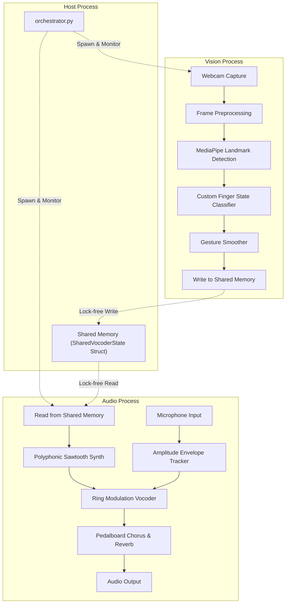

# 🖐️ Air Vocoder

[](https://www.python.org/)
[](https://mediapipe.dev/)
[](https://github.com/spotify/pedalboard)
[](https://opensource.org/licenses/MIT)

An interactive, real-time audio synthesizer controlled by hand gestures and modulated by vocal inputs. By mapping web-camera hand landmarks to synthesizer chord parameters, you can play music in the air while using your voice to shape the synth's envelope.

---

## ⚡ Key Features

*   **Real-time Hand Tracking**: Uses Google MediaPipe to track hand landmarks with sub-millisecond precision.
*   **Multi-process Architecture**: Uses Python `multiprocessing` with the `spawn` start method to keep the UI frame rate high (OpenCV/MediaPipe) and keep the audio callback stream (SoundDevice/ASIO) completely glitch-free.
*   **Lock-Free IPC**: High-speed communication via a C-struct shared memory mapping.
*   **Polyphonic Synthesizer**: Custom polyphonic sawtooth wave synth generating real-time chords.
*   **Voice Modulation (Vocoder)**: Multiplies the synth carrier with your voice envelope to create classic robot-voice vocoder effects.
*   **Professional Effects Chain**: Integrates Spotify's `pedalboard` library to add lush Chorus and spatial Reverb.

---

## 🏗️ Architecture & Data Flow



---

## 🎹 Chord Mapping Matrix

Chords are triggered by holding up fingers to count from `0` to `8`:

| Gesture | Finger Combination | Triggered Chord | MIDI Pitch Values |
| :--- | :--- | :--- | :--- |
| **`count_0`** | All fingers folded | **C major** (C4, E4, G4) | `[60, 64, 67]` |
| **`count_1`** | Index extended | **D minor** (D4, F4, A4) | `[62, 65, 69]` |
| **`count_2`** | Index + Middle extended | **E minor** (E4, G4, B4) | `[64, 67, 71]` |
| **`count_3`** | Index + Middle + Ring extended | **F major** (F4, A4, C5) | `[65, 69, 72]` |
| **`count_4`** | Index + Middle + Ring + Pinky extended | **G major** (G4, B4, D5) | `[67, 71, 74]` |
| **`count_5`** | All fingers extended (including Thumb) | **A minor** (A4, C5, E5) | `[69, 72, 76]` |
| **`count_6`** | Thumb extended | **B diminished** (B4, D5, F5) | `[71, 74, 77]` |
| **`count_7`** | Thumb + Index extended | **Cmaj7** (C4, E4, G4, B4) | `[60, 64, 67, 71]` |
| **`count_8`** | Thumb + Index + Middle extended | **Dmin7** (D4, F4, A4, C5) | `[62, 65, 69, 72]` |

---

## 🛠️ Installation & Setup

### Prerequisites
Make sure you have Python 3.8+ installed on your system.

### Steps
1. **Clone the repository**:
   ```bash
   git clone https://github.com/your-username/air_vocoder.git
   cd air_vocoder
   ```

2. **Install dependencies**:
   ```bash
   pip install -r requirements.txt
   ```

3. **Run the application**:
   ```bash
   python -m gesture_vocoder.orchestrator
   ```

---

## 🕹️ Controls & Interaction
*   **Start**: Run the orchestrator script. A webcam window will pop up.
*   **Playing Chords**: Position your hand in front of the camera. Hold up different finger counts (`0` to `8`) to select different chords.
*   **Vocoder Modulation**: Speak, hum, or whistle into your microphone. The synthesizer's volume and harmonics will match the envelope of your voice. If you remain quiet, the sound will gate off.
*   **Quit**: Press **`Q`** while focused on the camera window, or hit **`Ctrl+C`** in the terminal to cleanly terminate all processes and release shared memory.

---

## ⚙️ Project Structure

```text
air_vocoder/
├── assets/
│   └── banner.png                  # Project banner visual
├── gesture_vocoder/
│   ├── __init__.py
│   ├── orchestrator.py             # Spawns & cleans up vision & audio processes
│   ├── audio/
│   │   ├── __init__.py
│   │   └── engine.py               # SoundDevice streams & poly synth engine
│   ├── ipc/
│   │   ├── __init__.py
│   │   └── shared_state.py         # Shared memory ctypes structure definition
│   ├── mapping/
│   │   ├── __init__.py
│   │   └── chord_map.py            # Maps finger counts to MIDI notes
│   └── vision/
│       ├── __init__.py
│       └── pipeline.py             # OpenCV frame capture & MediaPipe tracking
├── models/
│   └── gesture_recognizer.task     # Pre-trained MediaPipe Model (auto-downloaded)
└── requirements.txt                # Python package list
```

---

## 📝 License
This project is licensed under the MIT License. See [LICENSE](LICENSE) for details.
